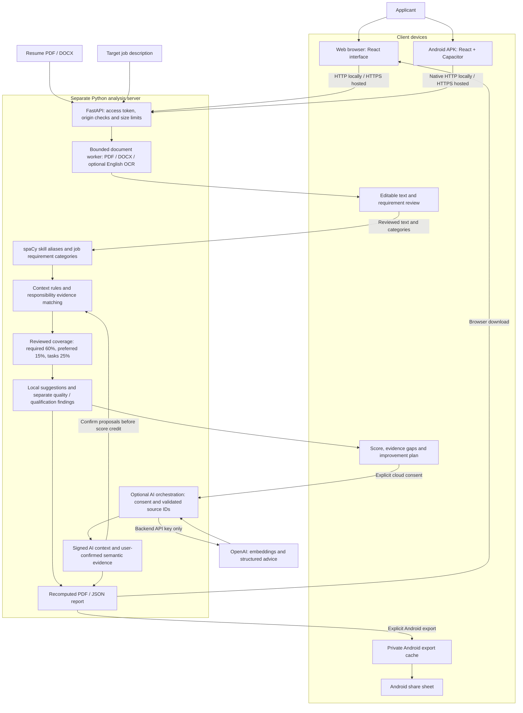

# CV Analyser

An AI and NLP-based resume analysis application for **Android and the web**. Compare a PDF or DOCX resume with a job description, review the extracted evidence, see an explainable ATS alignment estimate, identify missing skills, and receive suggestions for improving the resume.

The Android APK bundles the interface. A separate Python server performs document extraction and analysis. Optional OpenAI features add semantic evidence proposals and grounded advice after explicit consent.

## Features

- PDF and DOCX uploads with editable extracted-text review.
- Local English OCR for scanned PDF content when English language data is installed.
- A versioned dictionary of **128 canonical skills**, including approved aliases.
- Reviewed required/preferred skills and job responsibilities with source excerpts.
- Context checks for negated claims and statements about learning a skill.
- An estimated ATS alignment score with an explanation of category coverage.
- Missing-skill evidence, separate qualification findings, and five resume-quality checks.
- Local improvement suggestions and optional OpenAI semantic proposals and advice.
- PDF/JSON report exports, native Android sharing, and private export-cache controls.
- Backend access tokens for shared servers and bounded upload/request sizes.

## Technology stack

| Layer | Technology | Purpose |
| --- | --- | --- |
| Interface | React 19, TypeScript 5.9 | Guided input, evidence review and analysis results |
| Frontend tooling | Vite 7, npm lockfile | Development server and production build |
| Android app | Capacitor 8 | Package the web interface as an installable APK |
| Native integration | Capacitor HTTP, Filesystem and Share | API requests, private report cache and Android sharing |
| Android build | Java 21, Gradle wrapper, Android SDK 36 | Compile the APK for Android 7+ (minimum API 24) |
| API server | Python, FastAPI, Uvicorn | Validate requests and coordinate analysis |
| PDF extraction and exports | PyMuPDF | Read PDF text, use local OCR and render report PDFs |
| DOCX extraction | python-docx | Extract text from Word resumes |
| NLP | spaCy English tokenizer and PhraseMatcher | Match canonical skills and aliases without a pretrained model download |
| Matching and scoring | Python rules and reviewed evidence | Contextual matches, task evidence and weighted coverage |
| Optional cloud AI | OpenAI embeddings and Responses API | Propose semantic evidence and generate structured advice |
| Configuration | python-dotenv | Load private backend settings from `.env` |
| Verification | pytest, HTTPX, JSON Schema, Node test runner | Backend, frontend, response-contract and regression checks |
| CI | GitHub Actions | Run tests, synthetic evaluation and frontend build |
| Storage | In-memory analysis and private Android export cache | No application database or persistent analysis history |

The configured AI defaults are `gpt-4.1-mini` and `text-embedding-3-small`. They are backend settings, and live use requires a valid API key with model access.

## System architecture



**Execution boundary:** Extraction, NLP, scoring and local advice run on the Python server, not inside the APK. These steps need network access to that server but do not call OpenAI. Only the optional AI action sends eligible reviewed content to OpenAI. Analysis remains in memory, and exported files enter Android cache only when the user requests an export.

## Step 1: Install prerequisites

For the backend and web interface:

- Python **3.11+**. CI uses Python 3.12.
- Node.js **22+**, with npm.
- Git.

For an Android APK build, also install:

- Android Studio and Android SDK platform/build tools **36**.
- Java **21**. A compatible Android Studio JDK can be used.

The commands below use **Windows PowerShell**. Run backend commands from the repository root unless a step says otherwise.

## Step 2: Clone the project

```powershell
git clone https://github.com/SriVishnu230707/cv-analyser.git
cd cv-analyser
```

For an existing checkout, open its folder and pull the latest committed changes when your local work is ready:

```powershell
git pull
```

## Step 3: Create the Python environment

```powershell
python -m venv .venv
.\.venv\Scripts\python.exe -m pip install --upgrade pip
.\.venv\Scripts\python.exe -m pip install -r backend/requirements-dev.txt
```

Using the environment's Python executable directly avoids PowerShell activation-policy issues. The development requirements include the backend dependencies and test tools. For runtime dependencies alone, use `backend/requirements.txt`.

## Step 4: Configure backend settings

For a fresh checkout, create the ignored `.env` file:

```powershell
Copy-Item .env.example .env
```

If `.env` already exists, edit that file rather than overwriting your settings.

Generate a server access token:

```powershell
.\.venv\Scripts\python.exe -c "import secrets; print(secrets.token_urlsafe(32))"
```

Open `.env` in a text editor and set:

```dotenv
CV_API_TOKEN=replace-with-the-generated-token
OPENAI_API_KEY=
OPENAI_MODEL=gpt-4.1-mini
OPENAI_EMBEDDING_MODEL=text-embedding-3-small
CV_ALLOWED_ORIGINS=
```

- `CV_API_TOKEN` protects a shared API. The launcher requires at least **32 characters** when listening beyond loopback. Enter the same token in the app's server access settings.
- `OPENAI_API_KEY` is optional. Leave it empty for local analysis. Keep any real key on the backend only.
- `CV_ALLOWED_ORIGINS` optionally adds comma-separated browser origins for a custom web deployment. It is an origin control, not a replacement for the access token.

Restart the backend after changing these settings. Never commit `.env`, enter the OpenAI key into the Android app, or use it as the server access token.

## Step 5: Enable English OCR if needed

Text-based PDF and DOCX extraction work without downloading OCR language data. To support scanned English PDF content:

```powershell
powershell -ExecutionPolicy Bypass -File scripts/setup_ocr.ps1
```

The script downloads and verifies English language data in `.tools/tessdata`. PyMuPDF provides the local OCR engine. For a different language-data directory, set `TESSDATA_PREFIX` to a directory containing `eng.traineddata` before starting the backend.

## Step 6: Start the backend

For a browser on the same laptop:

```powershell
.\.venv\Scripts\python.exe scripts/run_backend.py --port 8001
```

The default address is `http://127.0.0.1:8001`. Check the health endpoint:

```powershell
Invoke-RestMethod http://127.0.0.1:8001/health
```

A working server returns `status: ok`. `ocr_available` indicates whether the English OCR data is available. Health alone does not verify access to protected analysis routes or OpenAI.

Keep this terminal running. The launcher's default port is 8000 if you omit `--port`, so use `--port 8001` to match these instructions.

## Step 7: Start the web interface

Open a **second terminal** at the repository root:

```powershell
cd frontend
npm ci
$env:BACKEND_URL = 'http://127.0.0.1:8001'
npm run dev
```

Open **http://127.0.0.1:5173**. If you configured `CV_API_TOKEN`, expand **Server access settings**, enter that token and save. Vite forwards API requests to the configured backend.

For a production frontend build:

```powershell
npm run build
```

This creates `frontend/dist`. The development setup above does not deploy a public service.

## Step 8: Build and install the Android APK

From the repository root:

```powershell
powershell -ExecutionPolicy Bypass -File scripts/build_android.ps1
```

The build script installs locked frontend dependencies, builds the interface, synchronizes Capacitor plugins/assets, compiles the debug APK and copies it to:

```text
output/android/cv-analyser-debug.apk
```

If the SDK or JDK is installed elsewhere:

```powershell
powershell -ExecutionPolicy Bypass -File scripts/build_android.ps1 -AndroidSdk 'C:\path\to\Android\Sdk' -JavaHome 'C:\path\to\jdk-21'
```

Install it on your phone:

1. Connect the phone using a USB data cable and enable **File transfer**.
2. Copy the APK to the phone's **Download** folder.
3. Open **My Files / Files → Download → cv-analyser-debug.apk**.
4. Allow installation from the file-opening app if Android requests it, then tap **Install**.
5. Open **CV Analyser**.

The APK is debug-signed for local demonstrations. It is generated locally and excluded from Git. A store release requires your own signing configuration and a hosted HTTPS backend.

## Step 9: Connect the phone to the analysis server

1. Connect the laptop and phone to the **same Wi-Fi**.
2. Stop the loopback backend if it already occupies port 8001.
3. Ensure `.env` contains a server access token of at least 32 characters.
4. Start the backend from the repository root:

   ```powershell
   .\.venv\Scripts\python.exe scripts/run_backend.py --host 0.0.0.0 --port 8001
   ```

5. Run `ipconfig` and find the laptop's **Wi-Fi IPv4 address**.
6. In the phone app, expand **Android server settings**.
7. Enter `http://YOUR-LAPTOP-WIFI-IP:8001` and the same `CV_API_TOKEN`.
8. Tap **Test connection**, then **Save server**. Saving restarts the current review.
9. Keep the laptop awake and the backend running.

For example, if the laptop's Wi-Fi address is `192.168.0.105`, enter:

```text
http://192.168.0.105:8001
```

The IP address is an example and can change when the laptop reconnects. Use **HTTP** for this local debug server. HTTPS requires a server configured with TLS. Allow the backend through Windows Firewall on your private network when prompted.

The APK does **not** require Vite or port 5173. A data cable alone transfers the APK but does not establish a connection to the analysis server. The app keeps the server URL on the device and keeps the token for the current app session.

For an Android emulator, use `http://10.0.2.2:8001` with the shared backend. With USB debugging enabled and the device authorized in ADB, you can alternatively run `adb reverse tcp:8001 tcp:8001` and use `http://127.0.0.1:8001` on the phone.

## Step 10: Analyze a resume

1. Choose a PDF or DOCX resume, or load the built-in synthetic example.
2. Paste the target job description and select **Extract resume text**.
3. Correct the extracted text and confirm that you reviewed it.
4. Select **Extract skills & requirements**.
5. Inspect source excerpts, resolve ambiguous categories and confirm the job requirements.
6. Compare the reviewed evidence with the target job.
7. Read the estimated ATS alignment, matched evidence and requirements not evidenced.
8. Review qualification findings, readability and resume-quality suggestions separately.
9. Optionally request cloud AI analysis as described below.
10. Export a PDF or JSON report. On Android, choose a share destination to save a copy.

Use **Clear cached reports** in Android server settings after the receiving app finishes saving your report. Android can reclaim private cache files. Editing the resume or job requirements invalidates the previous analysis and requires review again.

## Optional: Enable OpenAI advice

1. Set a valid `OPENAI_API_KEY` privately in the root `.env` file.
2. Restart the backend and complete the local reviewed comparison.
3. Open **AI and semantic resume analysis**.
4. Read and accept the cloud disclosure.
5. Select **Generate AI advice and semantic proposals**.
6. Review possible evidence and explicitly confirm relevant proposals before they earn score credit.

The backend sends eligible reviewed content to OpenAI. API charges can apply. Generated advice references known requirements and resume sources. Resume wording suggestions must be complete source sentences copied exactly from the cited evidence. The application does not automatically rewrite the uploaded resume.

A configured key does not prove that the account has credit or access to the selected models. Local scoring and guidance remain available when cloud AI is disabled or fails. See [AI setup and grounding](docs/phase-9.md).

## How the score works

| Reviewed category | Base weight |
| --- | ---: |
| Required skills | 60% |
| Preferred skills | 15% |
| Responsibilities | 25% |

Each component measures credited evidence against its included requirements. When a component has no included requirements, its weight is removed and the remaining weights are normalized. With no scorable requirements, the app reports insufficient requirements instead of inventing a score.

Qualifications, years-of-experience findings, readability and resume quality do not add points to this score. Negated or learning statements receive no automatic positive credit. Possible semantic evidence requires user confirmation.

**The ATS score is an application estimate of documented job coverage.** It is not an employer's proprietary ATS result, verified skill proficiency, or a hiring probability.

## Troubleshooting

| Problem | What to check |
| --- | --- |
| Unable to parse TLS header / invalid HTTP request | Use `http://`, not `https://`, for the local server started by this guide. Hosted HTTPS needs a TLS configuration. |
| Phone cannot connect | Check the Wi-Fi IPv4 address, port 8001, same Wi-Fi, backend bind address and Windows Firewall. Guest Wi-Fi can isolate devices. |
| Phone uses localhost | Use the laptop's Wi-Fi IP. Phone localhost refers to the phone unless you configured ADB reverse. |
| Access denied / 401 | Enter the backend's `CV_API_TOKEN`, save it, and re-enter it after a fresh app session. |
| Browser loads but analysis fails | Keep the API running and set `BACKEND_URL` before starting Vite. Check server access settings. |
| English OCR unavailable | Run `scripts/setup_ocr.ps1`, verify `eng.traineddata`, and restart the backend. |
| AI is not configured | Set the backend OpenAI key and restart. The Android server token is a separate credential. |
| Android build fails | Confirm Java 21 and Android SDK platform/build tools 36. Use the build script's path overrides if needed. |
| Report seems to disappear | Android exports use temporary private cache. Save a copy through the share sheet before clearing cache. |

## Tests and verification

Backend checks from the repository root:

```powershell
.\.venv\Scripts\python.exe -m pytest backend/tests -q
.\.venv\Scripts\python.exe scripts/evaluate_alignment.py
```

Frontend checks in a separate terminal:

```powershell
cd frontend
npm ci
npm test
npm run build
```

The [GitHub Actions workflow](.github/workflows/verify.yml) runs these checks on pushes and pull requests. OCR tests can skip when English language data is unavailable. Live OpenAI calls do not run automatically in CI.

The recorded version 0.11.1 verification included **192 backend tests**, **27 frontend tests**, a successful frontend build and Android APK build/signature checks. Emulator checks covered native uploads, reviewed analysis, PDF/JSON exports and sharing. Those results are scoped to the recorded environment. Independent real-world accuracy evaluation, live OpenAI verification and complete physical-device/release testing remain separate tasks.

For an explicitly requested synthetic live-provider check, follow [verification and release checks](docs/verification.md). Authored synthetic matching fixtures are regression cases, not evidence of universal accuracy.

## Data handling and limits

- Resume file limit: **5 MiB**. Complete request-body limit: **6 MiB**.
- PDF limit: **10 pages**. Resume text limit: **50,000 characters**.
- Job descriptions: **100–20,000 characters** for review.
- No application database, user-account system or persistent report history.
- Reviewed analysis remains in memory. Android report files enter private cache only on explicit export.
- OpenAI credentials stay on the backend. Optional cloud analysis requires consent.
- Debug builds allow HTTP for controlled local demonstrations. Release builds require a properly hosted HTTPS service.
- Access tokens, `.env`, logs, generated APKs, reports and temporary artifact files are excluded from Git.

See the [security review](docs/security-review.md) and [Android guide](docs/android.md) for deployment and file-handling details.

## Repository structure

```text
cv-analyser/
├── backend/
│   ├── main.py                  # FastAPI routes
│   ├── security.py              # Access control and body limits
│   ├── data/                    # Versioned skills and task rules
│   ├── services/                # Extraction, NLP, matching, AI and reports
│   └── tests/                   # Backend regression tests
├── frontend/
│   ├── src/                     # React interface and native integrations
│   ├── tests/                   # Frontend and native request tests
│   └── android/                 # Capacitor Android project
├── contracts/                   # JSON schemas for reviewed data and reports
├── data/                        # Synthetic development/evaluation fixtures
├── scripts/                     # Backend runner, APK build and evaluations
├── docs/                        # Phase notes and setup/verification guides
├── .github/workflows/verify.yml # Continuous integration
└── .env.example                 # Configuration template, no real secrets
```

## Detailed project documentation

- [MVP requirements](docs/phase-1/requirements.md) and [report contract](docs/phase-1/result-contract.md)
- [NLP extraction and requirement review](docs/phase-4.md)
- [Matching and scoring design](docs/phase-5-design.md)
- [AI setup and grounding](docs/phase-9.md)
- [Current matching and resume improvement](docs/phase-10.md)
- [Android installation and builds](docs/android.md)
- [Security review](docs/security-review.md)
- [Verification and release checks](docs/verification.md)
- [Synthetic dataset guide](data/phase-1/README.md)

Historical phase notes describe the implementation at that phase. Use the setup above for the current application.

Project repository: [SriVishnu230707/cv-analyser](https://github.com/SriVishnu230707/cv-analyser).
